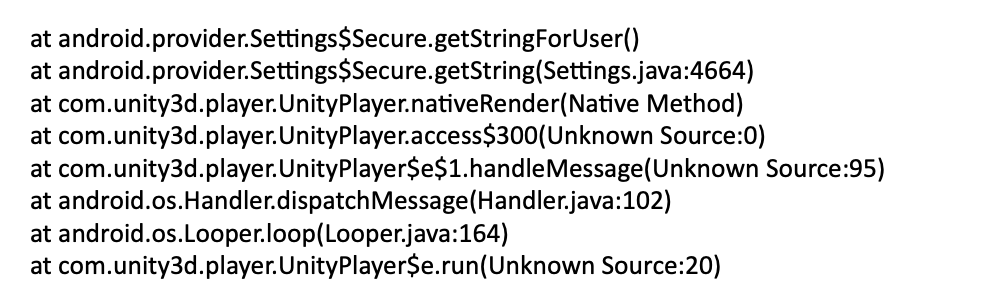
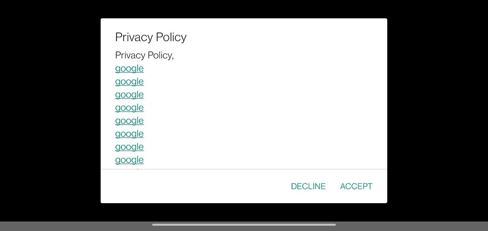

# unity-android-privacy-activity
This example allows to implement Privacy Policy activity before Unity game starts

## Why you may needed that?

I've tried to publish an Unity game to Chinese stores (like Xiaomi or Vivo).
Some of them reject build because `ANDROID_ID` value is read BEFORE user accepted Privacy Policy.

Even if I disable ALL Unity services, `android_id` was still requested by Unity engine.
Chinese stores usually returned reject stacktrace like this (which was helpless for me):



As I could find, it's a strange Unity behavior, that is hard to fix.
You can read a little about this problem [on unity forum](https://forum.unity.com/threads/when-unity-starts-on-android-its-collecting-android_id-can-we-disable-it.1264613/)

## Solution

We can run Privacy Policy BEFORE Unity activity starts.

Then, if user accepted privacy policy, load main Unity activity (and never show Privacy Policy on next app starts).

If user declined it, immediately close the game.



## How to use

1. Copy `Assets/Plugins/Android/PrivacyActivity.java` from this project to your `Assets/Plugins/Android` folder.
2. Modify Privacy Policy text in (links are also supported)
3. Modify default `Assets/Plugins/AndroidManifest.xml`:
```xml
<application>
    <!--
    replace    android:name="com.unity3d.player.UnityPlayerActivity"
    to         android:name="com.gamesofton.privacy.PrivacyActivity"
    -->
    <activity android:name="com.gamesofton.privacy.PrivacyActivity" android:theme="@style/UnityThemeSelector">
        <intent-filter>
            <action android:name="android.intent.action.MAIN" />
            <category android:name="android.intent.category.LAUNCHER" />
        </intent-filter>
        <meta-data android:name="unityplayer.UnityActivity" android:value="true" />
    </activity>
    <!--
    Register default unity activity, to allow it to start from Privacy Policy activity via Intent
    -->
    <activity android:name="com.unity3d.player.UnityPlayerActivity"  />
</application>
```